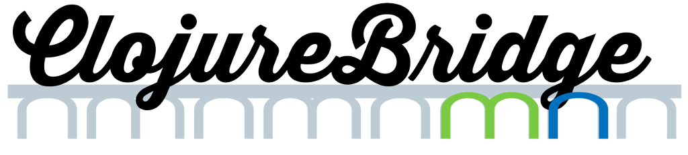

# ClojureBridge MN - Fall 2016

Welcome to the ClojureBridge MN getting started page!

### Friday
* Everyone 
  * [Installfest](docs/setup.md) *instructions for getting ready*
* Track 2 only 
  * [clojure-koans-intro](docs/koans.md) *a quick guide to get you started on the Clojure koans*

### Saturday
* Track 1 - Chatter App
  * [track1-chatter](https://github.com/clojurebridge-minneapolis/track1-chatter) *the sample application for Track 1*
* Track 2 - Functional Programming
  * Morning
    * [clojure-koans](https://github.com/clojurebridge-minneapolis/clojure-koans)
  * Afternoon  
    * [track2-functional](https://github.com/clojurebridge-minneapolis/track2-functional)
* Everyone
  * Before you leave, please complete the [Survey](https://www.surveymonkey.com/r/95PD8LR).  
  We're all volunteers and we really want to make ClojureBridge better!
  Your frank feedback is essential!
  * [Resources](docs/resources.md) *pointers to all kinds of Clojure resources*

*NOTE:* you can refer to this page with this short url: http://bit.ly/cb-mn

### Copyright and License

Copyright © 2015 Tom Marble

Licensed under the [MIT](http://opensource.org/licenses/MIT) [LICENSE](LICENSE)
