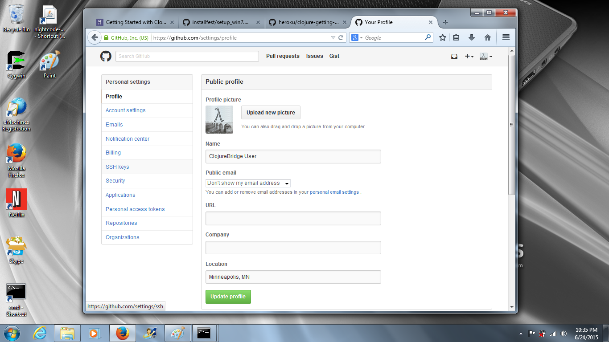
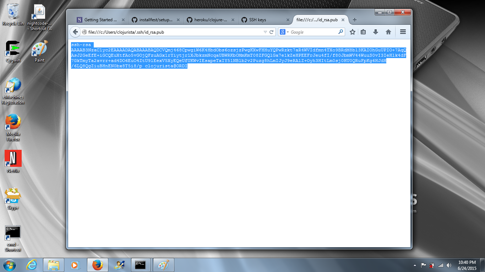
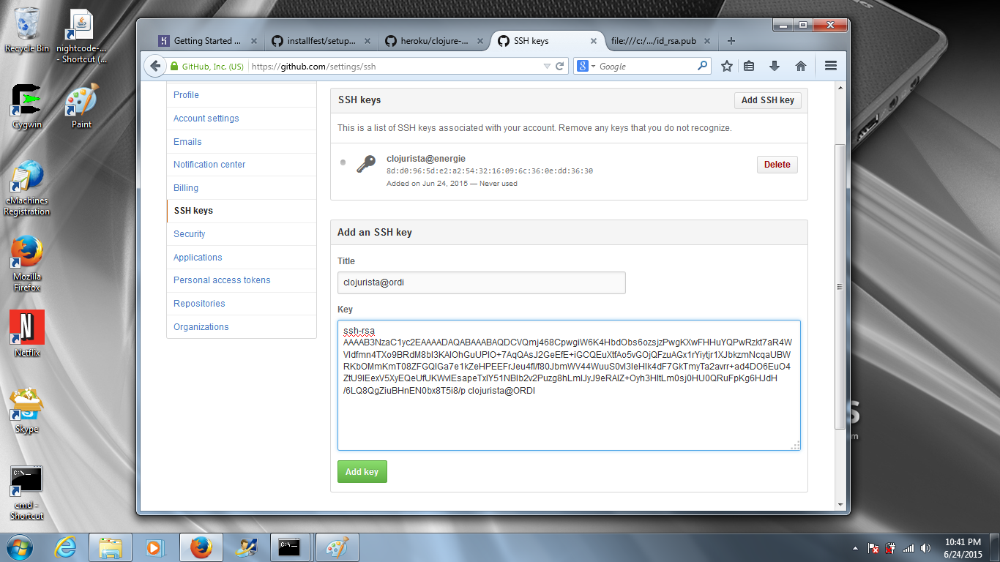

# Setup github

*NOTE: This page is now obsolete (for reference only!)*

## Create a github account

Github has become the _de facto_ location to publish
computer source code. Hosting open source projects is free!

Create a new github account here: https://github.com/join

## Go to your settings page

Click on settings and find the `SSH Keys` option on the
left navigation bar:

## Open your public key in a new browser tab

In your web browser navigate to your new public SSH key.

The URL will be like:
* Mac: [file:///Users/clojurista/.ssh/id_rsa.pub](file:///Users/clojurista/.ssh/id_rsa.pub)
* Windows: [file:///c:|/Users/clojurista/.ssh/id_rsa.pub](file:///c:|/Users/clojurista/.ssh/id_rsa.pub)
* Linux: [file:///home/clojurista/.ssh/id_rsa.pub](file:///home/clojurista/.ssh/id_rsa.pub)

Except you will need to replace `clojurista` with your username.

Copy all the contents of the file.

## Add the SSH to github

Back in the github settings tab...

1. Click "Add SSH Key"
2. Enter a title for the key
3. Paste the key contents
4. Click "Add Key"

Now you will be able to clone and push git repositories to your account
using the SSH method. For most repositories that you copy just
to read one typically uses the `https` URL:

    git clone https://github.com/clojurebridge-minneapolis/clojure-koans.git

For your own repositories (or ones you have permission to edit) you
can use the SSH URL:

    git clone git@github.com:clojurebridge-minneapolis/clojure-koans.git
