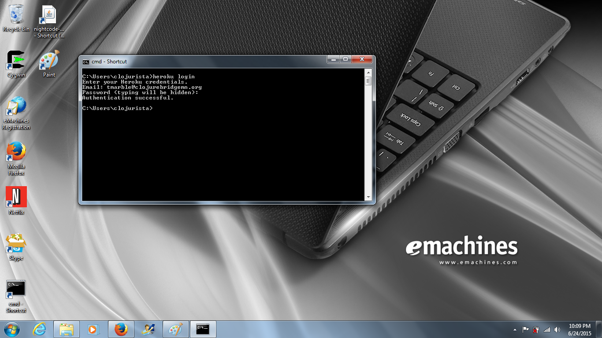
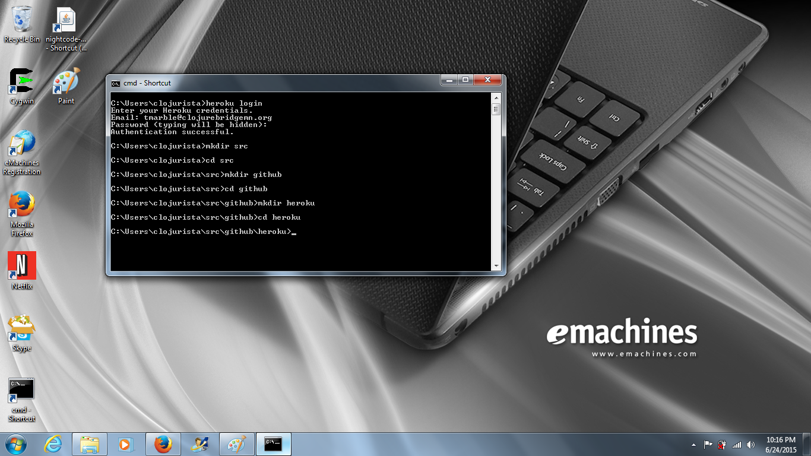

# Getting Started with Heroku

## Verify the heroku toolbelt installation

In a previous step we installed the Heroku toolbelt.
Check the Heroku version on the command line:

    heroku version

You should see something like `heroku/toolbelt/3.38.3`...

## Login to Heroku

Now we'll use the toolbelt to login to your Heroku account:

    heroku login

You will be prompted for the e-mail address and password you
used when you signed up for Heroku.

_NOTE: behind the scenes it will copy your public SSH key to your Heroku profile)._



## Make a new directory for the application

We're going to follow the instructions in the https://github.com/heroku/clojure-getting-started repo...

First things first.. Let's make a directory where that repo
should land... One commen convention is to use

**~/src/SERVICE/ORGANIZATION/REPO**

_where_
* ~ is your home directory
* src is where you will keep source code
* SERVICE is the name of the service provide (e.g. github)
* ORGANIZATION is the name of the user or organization publishing the repository (e.g. clojurebridge-minneapolis)
* REPO is the name of the repository itself (e.g. track1-chatter)

So for the current example we can make that series of directories
like this:

````
clojurista@mylaptop $ mkdir -p ~/src/github/heroku
clojurista@mylaptop $ cd ~/src/github/heroku
````


## Clone the clojure-getting-started repo

Now we'll

1. Download a copy of the repo from github to your local hard drive
2. Change to the new repo directory
3. Start a Leiningen REPL

````
clojurista@mylaptop $ git clone https://github.com/heroku/clojure-getting-started.git
clojurista@mylaptop $ cd clojure-getting-started
clojurista@mylaptop $ lein repl
````


## Start the program

Now that the REPL has started you can enter these
to commands to start the program:

````
user=> (require 'clojure-getting-started.web)
user=> (def server (clojure-getting-started.web/-main))
````

_NOTE: on some platforms your firewall may need to ask permissions for Java to connect to the Internet_

## View the running program in a web browser

You should be able to open your browser to: http://localhost:5000

...and see a very simple web page served from the sample program you just started!


## Stop the program

Once you've tried the server you can shut it down gracefully
with the `(.stop server)` command and exit the REPL with `(exit)`:

````
user=> (.stop server)
user=> (exit)
````


## Publish the program to the Internet using Heroku

That was cool, but only worked on your local laptop.
Now you can publish the application to Heroku so anyone
on the Internet can access it!

We'll use the Heroku toolbelt to put the program into production...

````
clojurista@mylaptop $ heroku create
clojurista@mylaptop $ git push heroku master
clojurista@mylaptop $ heroku open
````
When you publish a program to Heroku is uses a kind of random
domain name. You can type this into your browser by hand -or-
simply type `heroku open` to open the correct URL in your browser.

Now you see the same program running.. With the important
difference that you can share this URL with all of your friends!


