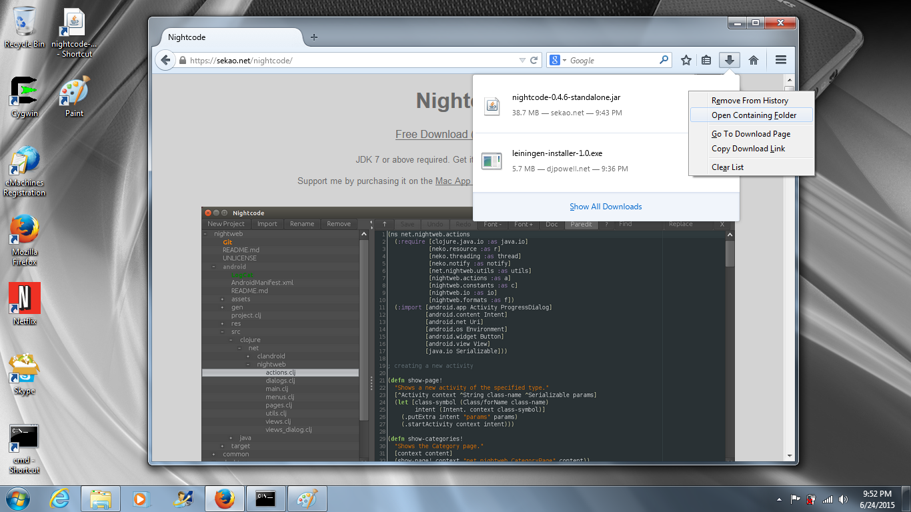
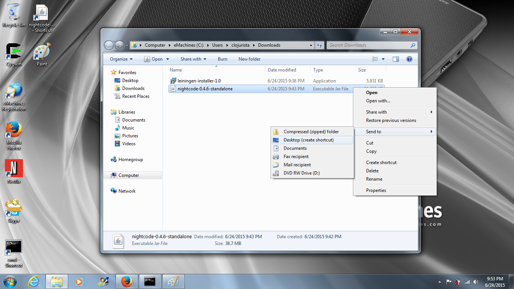
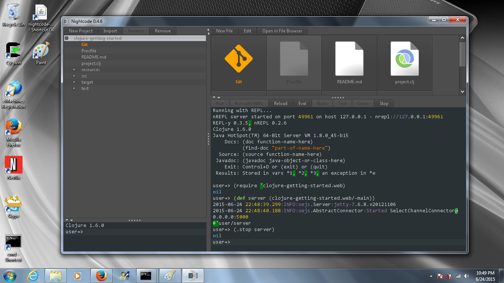

# Install Nightcode

## Download Nightcode

Nightcode is an integrated development environment (IDE) for
creating Clojure programs. You can download it from:

https://sekao.net/nightcode/

## Setup Nightcode on Windows

In your brower can you can right click on the nightcode jar file
and select "open containing folder"



Once you are viewing the Downloads folder in Explorer, right
click on the jar file and select **Send to | Desktop (create shortcut)**



On Windows you can double click on jar files to launch them..
So double click on the nightcode jar:


Finally you can open the **clojure-getting-started** project we worked on
in Nightcode:



## Setup Nightcode on Mac

Change directories to your `~/bin` directory and download Nightcode,
then download the nightcode launcher from our website.

````
clojurista@mylaptop $ cd ~/bin
clojurista@mylaptop $ curl -LO https://github.com/oakes/Nightcode/releases/download/0.4.7/nightcode-0.4.7-standalone.jar
clojurista@mylaptop $ curl -LO https://raw.githubusercontent.com/clojurebridge-minneapolis/installfest/experimental/docs/nightcode
clojurista@mylaptop $ chmod +x nightcode
clojurista@mylaptop $ cd ..
clojurista@mylaptop $ nightcode
````

Since the `~/bin` directory is already in your **PATH** you can
start nightcode from anywhere with `nightcode`.

Now you can open the **clojure-getting-started** repo in Nightcode (see above).


## Setup Nightcode on Linux

The setup for Linux is the same as for Mac!

You _might_ encounter a problem where Nightcode seems to
crash after startup... If that happens you probably need
to be running a compositing Window Manager. You can add this
feature to your current environment by adding this package:

````
# apt-get install xcompmgr
````

And starting the compositing manager before Nightcode:

````
clojurista@mylaptop $ xcompmgr &
clojurista@mylaptop $ nightcode
````

Now you can open the **clojure-getting-started** repo in Nightcode (see above).
