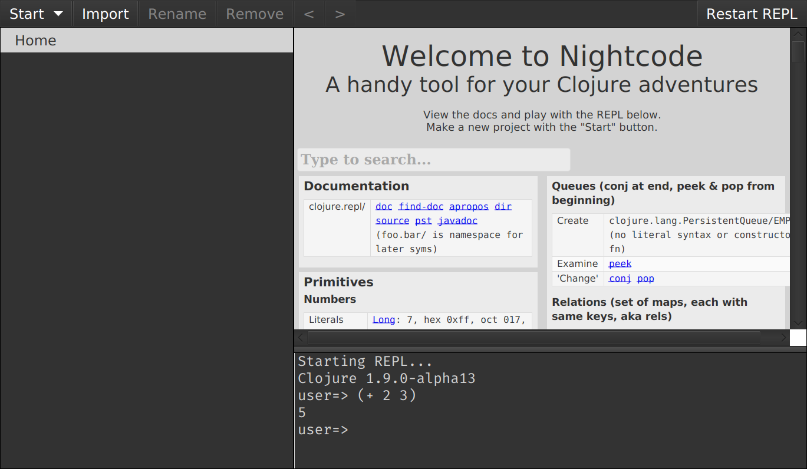
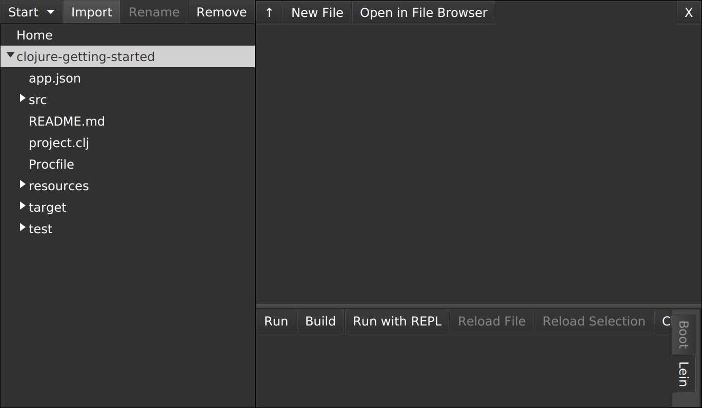
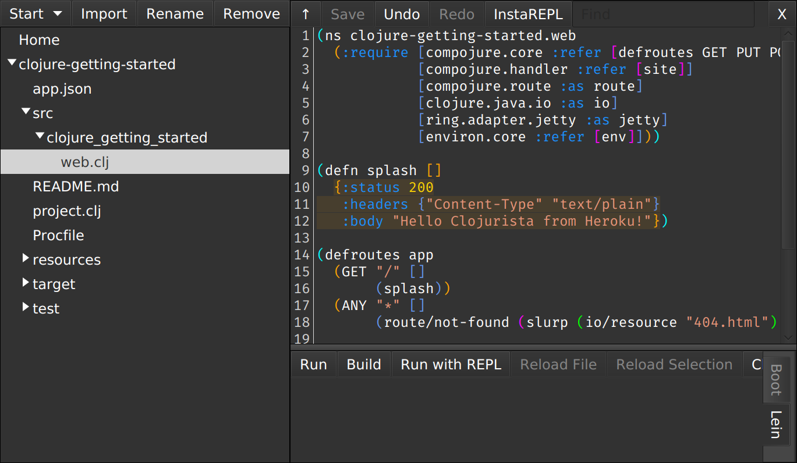
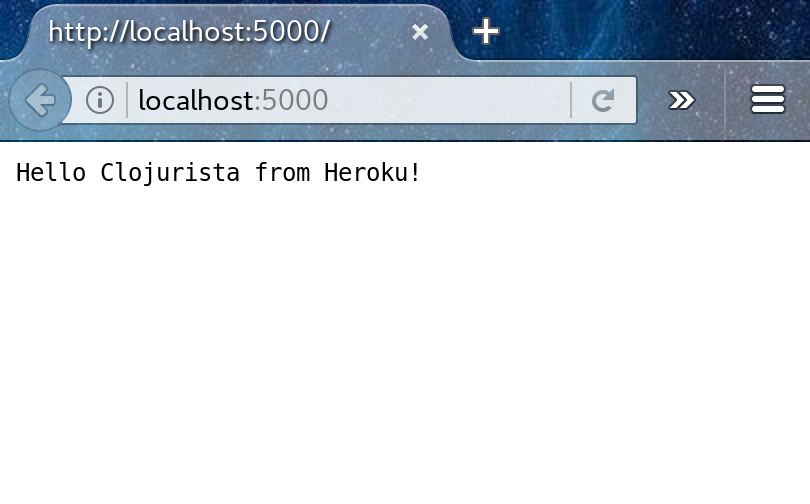
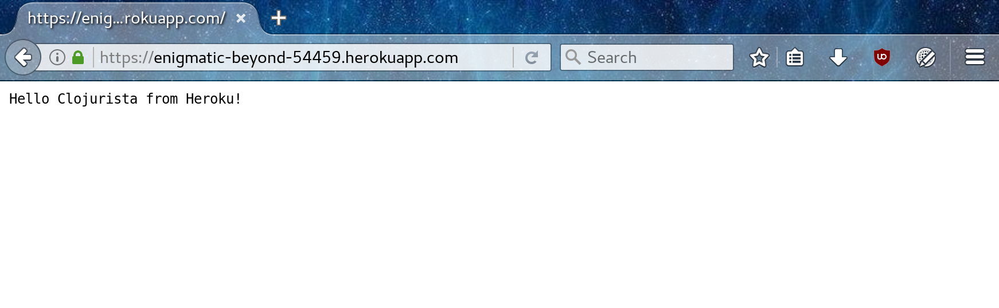

Linux Setup
===========

## Starting a terminal

For these instructions, and for much of the class, you will need to have a terminal, or command line, open. This is a text-based interface to talk to your computer, and you can open it by clicking "Dash Home" and typing `Terminal`. You can also open a terminal at any time by pressing `CTRL-ALT-T`. If you have never used the terminal before, you may want to spend some time [reading up on command-line basics](http://blog.teamtreehouse.com/command-line-basics).

Go ahead and open your terminal now. It should look something like this:


The prompt (where you will type your commands) may look different: it usually shows the computer name and user name, as well as the folder or directory you are currently in.

For the rest of this setup, I will tell you to run commands in your terminal. When I say that, I mean "type the command into the terminal and press the Return key."

## Installing Git and Ruby

The **git** version control system is packaged for your Linux distribution.
On Debian Ubuntu systems you can install it with the following
*(as the superuser)*:

```
root@mylaptop# apt-get update
root@mylaptop# apt-get install git git-core git-man ruby
```

*NOTE: We are installing Ruby because it's needed by the Heroku Command Line Interface*

## Installing Java

Typically you can use the Java that's packaged or your Linux
distribution (e.g. for Debian and Ubuntu it's the package
**openjdk-8-jdk**). However because we're using Nightcode and
Nightcode *requires* the Oracle JDK you will need to download
and install it from the [Oracle Java SE Downloads](http://www.oracle.com/technetwork/java/javase/downloads/jdk8-downloads-2133151.html) page.

You can install the Oracle JDK one of your subdirectories like this:

```
clojurista@mylaptop$ mkdir -p ~/src/oracle/
clojurista@mylaptop$ cd ~/src/oracle/
clojurista@mylaptop$ tar -zxf jdk-8u112-linux-x64.tar.gz
clojurista@mylaptop$ export JAVA_HOME=$HOME/src/oracle/jdk1.8.0_112
clojurista@mylaptop$ export PATH=$JAVA_HOME/bin:/usr/local/heroku/bin:$HOME/bin:$PATH
clojurista@mylaptop$ which java
/home/clojurista/src/oracle/jdk1.8.0_112/bin/java
clojurista@mylaptop$ java -version
java version "1.8.0_112"
Java(TM) SE Runtime Environment (build 1.8.0_112-b15)
Java HotSpot(TM) 64-Bit Server VM (build 25.112-b15, mixed mode)
clojurista@mylaptop$
```

The details of Java's version may differ from what you see above; that is perfectly fine.

*NOTE: your `~/bin` directory was also added to your PATH because we will put the **nightcode** and **lein** launcher scripts there and the `/usr/local/heroku/bin` directory was added to your PATH because we will put the **heroku** launcher script there*

## Installing Nightcode

On the [Nightcode home page](https://sekao.net/nightcode/) you can download
and install a `*.deb` for Debian/Ubuntu, `*.rpm` for RedHat/Fedora,
or `*.jar` file for any other distribution.

If you download the `*.jar` you can place it in your `~/bin` directory and
use our handy launcher script. NOTE: for this method we also install the
Clojure jar here to get started:

```
clojurista@mylaptop$ cd ~/bin
clojurista@mylaptop$ mv ~/Downloads/Nightcode*.jar ./
clojurista@mylaptop$ curl -O https://raw.githubusercontent.com/clojurebridge-minneapolis/installfest/master/docs/linux/nightcode
clojurista@mylaptop$ chmod +x nightcode
```

Now you should be able to launch it by typing `nightcode` in a terminal:



This is starting a REPL... which we will learn about soon. It's a special
terminal for Clojure. At the REPL prompt type `(+ 2 3)` and press Return.
Did you get the answer `5` back?
You will learn more about that in the workshop.

## Installing Leiningen

Leiningen is a tool used on the command line to manage Clojure projects.

Go to the [Leiningen website](http://leiningen.org/). You will see a link to the `lein` script under the "Install" heading. Right-click that link and choose "Save Link As...". Save it in your Downloads directory.


After that, run the following commands in your terminal:

```
clojurista@mylaptop$ cd ~/bin
clojurista@mylaptop$ mv ~/Downloads/lein ./
clojurista@mylaptop$ chmod +x lein
clojurista@mylaptop$ lein version
Leiningen 2.7.1 on Java 1.8.0_112 Java HotSpot(TM) 64-Bit Server VM
clojurista@mylaptop$
```

After you run the above commands, run the `lein version` command. It should take a while to run, as it will download some resources it needs the first time. If it completes successfully, you are golden! If not, ask an instructor for help.

## Installing the Heroku Command Line Interface (CLI)

Heroku is the tool we will use in order to put your application online where others can see it.

First, we need to create an account. Go to [Heroku](http://heroku.com) and click the "Sign up" link.


You will be taken to a form where you need to enter your email address in order to sign up. Fill out that form, and you will be sent an email with a link to click to continue the signup process.


After clicking on the link, you will be taken to another form where you will need to choose a password. Choose one and enter it twice.


After all that, you should be at your Heroku dashboard. There will be a link on the dashboard to download the Heroku Command Line Interface. Download it now.


If you do not see this link on your dashboard, you can download the Heroku Command Line Interface from [toolbelt.heroku.com](https://toolbelt.heroku.com/).

From the "Heroku Command Line" web page you can copy/paste the
command to script to install the Heroku Command Line Interface to
`/usr/local/heroku` *(as the superuser)*:

```
root@mylaptop# wget -qO- https://toolbelt.heroku.com/install.sh | sh
This script requires superuser access to install software.
You will be prompted for your password by sudo.
Add the Heroku CLI to your PATH using:
$ echo 'PATH="/usr/local/heroku/bin:$PATH"' >> ~/.profile
root@mylaptop#
```

*NOTE: We already added `/usr/local/heroku/bin` to the PATH above*

You can test that the basic **heroku** command works like this:

```

clojurista@mylaptop$ heroku --version
heroku-toolbelt/3.43.12 (x86_64-linux-gnu) ruby/2.3.1
heroku-cli/5.4.8-eee5ec9 (linux-amd64) go1.7.1
You have no installed plugins.
clojurista@mylaptop$
```

Now you can login to heroku the first time:

```
clojurista@mylaptop$ heroku login
Enter your Heroku credentials.
Email: clojurista@gmail.com
Password (typing will be hidden): ++++++++
Logged in as clojurista@gmail.com
clojurista@mylaptop$
```

## Testing your setup

You have set up Java, Nightcode, Leiningen, Git, and Heroku on your computer -- all the tools you will need for this course. Before starting, we need to test them out.

Go to your terminal and download a copy of the [clojure-getting-started](https://github.com/heroku/clojure-getting-started) repository:

```
clojurista@mylaptop$ mkdir -p ~/src/github/heroku
clojurista@mylaptop$ git clone https://github.com/heroku/clojure-getting-started.git
clojurista@mylaptop$ cd clojure-getting-started
clojurista@mylaptop$
```

Now in Nightcode click the **Import** button and select the **clojure-getting-started** directory:



Open the `web.clj` file by opening up the `src` and `clojure-getting-started` directories. Then change the line ` :body "Hello from Heroku"})` with
` :body "Hello Clojurista from Heroku!"})` (i.e. you can put in your
name or anything you want)!



Now click the **Save** button. We'll save this change in **git** by
making the following commit:

```
clojurista@mylaptop$ git commit -a -m 'modified greeting'
git commit -a -m 'modified greeting'
[master 2824daa] modified greeting
 1 file changed, 1 insertion(+), 1 deletion(-)
clojurista@mylaptop$
```

Now you can start the sample application on your laptop using **lein repl**.
The first two Clojure commands start the application. You can then
visit the application webpage on your laptop at
[http://localhost:5000](http://localhost:5000).
Then you can shut down the application and exit with the last
two commmands.

0. `lein repl`
1. `(require 'clojure-getting-started.web)`
2. `(def server (clojure-getting-started.web/-main))`
3. Now you can open the web page at [http://localhost:5000](http://localhost:5000)

4. `(.stop server)`
5. `(exit)`


```
clojurista@mylaptop$ lein repl
Retrieving environ/environ.lein/0.3.1/environ.lein-0.3.1.pom from clojars
Retrieving environ/environ.lein/0.3.1/environ.lein-0.3.1.jar from clojars
Warning: cider-nrepl requires Clojure 1.7 or greater.
Warning: cider-nrepl will not be included in your project.
Warning: cider-nrepl requires Clojure 1.7 or greater.
Warning: cider-nrepl will not be included in your project.
Retrieving environ/environ/1.0.0/environ-1.0.0.pom from clojars
Retrieving environ/environ/1.0.0/environ-1.0.0.jar from clojars
nREPL server started on port 42509 on host 127.0.0.1 - nrepl://127.0.0.1:42509
REPL-y 0.3.7, nREPL 0.2.12
Clojure 1.6.0
OpenJDK 64-Bit Server VM 1.8.0_111-8u111-b14-2-b14
    Docs: (doc function-name-here)
          (find-doc "part-of-name-here")
  Source: (source function-name-here)
 Javadoc: (javadoc java-object-or-class-here)
    Exit: Control+D or (exit) or (quit)
 Results: Stored in vars *1, *2, *3, an exception in *e

user=> (require 'clojure-getting-started.web)
2016-10-28 14:05:21.439:INFO::nREPL-worker-0: Logging initialized @17071ms
nil
user=> (def server (clojure-getting-started.web/-main))
(def server (clojure-getting-started.web/-main))
2016-10-28 14:05:30.163:INFO:oejs.Server:nREPL-worker-0: jetty-9.2.10.v20150310
2016-10-28 14:05:30.203:INFO:oejs.ServerConnector:nREPL-worker-0: Started ServerConnector@379cb9a6{HTTP/1.1}{0.0.0.0:5000}
2016-10-28 14:05:30.204:INFO:oejs.Server:nREPL-worker-0: Started @25837ms
#'user/server
user=> (println "open http://localhost:5000")
open http://localhost:5000
user=> (.stop server)
2016-10-28 14:06:15.811:INFO:oejs.ServerConnector:nREPL-worker-1: Stopped ServerConnector@379cb9a6{HTTP/1.1}{0.0.0.0:5000}
nil
user=> (exit)
Bye for now!
clojurista@mylaptop$
```

Yay! Your first web application works on your laptop!


Now you can push the application to the web via **heroku create**:

```

clojurista@mylaptop$ heroku create
Creating app... done, enigmatic-beyond-54459
https://enigmatic-beyond-54459.herokuapp.com/ | https://git.heroku.com/enigmatic-beyond-54459.git
clojurista@mylaptop$ git push heroku master
Counting objects: 41, done.
Delta compression using up to 4 threads.
Compressing objects: 100% (38/38), done.
Writing objects: 100% (41/41), 6.36 KiB | 0 bytes/s, done.
Total 41 (delta 15), reused 0 (delta 0)
remote: Compressing source files... done.
remote: Building source:
remote:
remote: -----> Clojure (Leiningen 2) app detected
remote: -----> Installing OpenJDK 1.8... done
remote: -----> Installing Leiningen
remote:        Downloading: leiningen-2.6.1-standalone.jar
remote:        Writing: lein script
remote: -----> Building with Leiningen
remote:        Running: lein uberjar
remote:        Retrieving environ/environ.lein/0.3.1/environ.lein-0.3.1.pom from clojars
...more output...
remote: -----> Launching...
remote:        Released v3
remote:        https://enigmatic-beyond-54459.herokuapp.com/ deployed to Heroku
remote:
remote: Verifying deploy... done.
To https://git.heroku.com/enigmatic-beyond-54459.git
 * [new branch]      master -> master
clojurista@mylaptop$ heroku open
clojurista@mylaptop$
```

Your browser should open (and take a long time to load), and you should see a website like the following:



If your browser does not open after running `heroku open`, start a browser and go to the URL displayed after you ran `heroku create`.

Congratulations! That website is running the code you have
uploaded to the Interet!!!
You have made a very simple Clojure app and you are all set up to make more!

You're ready for the workshop!!!
