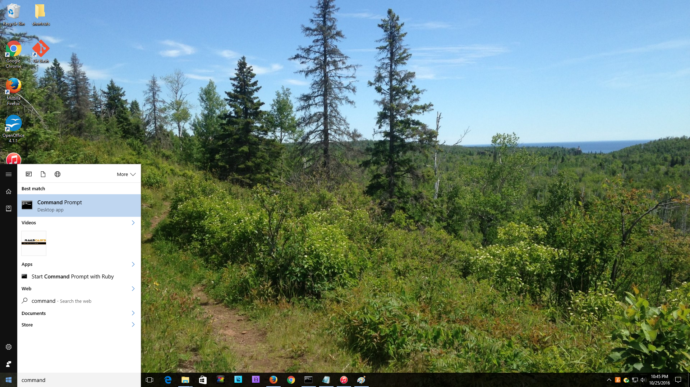
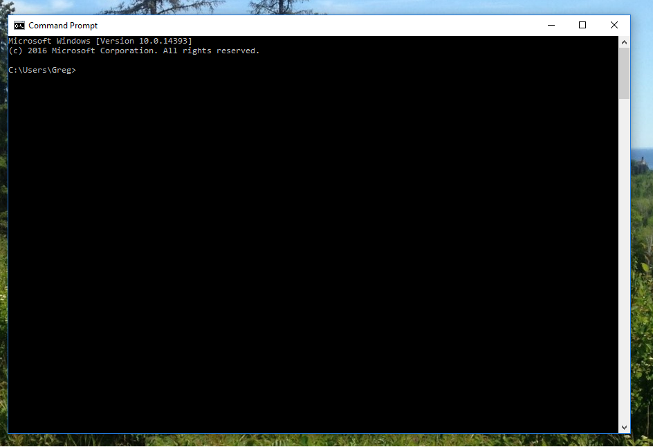
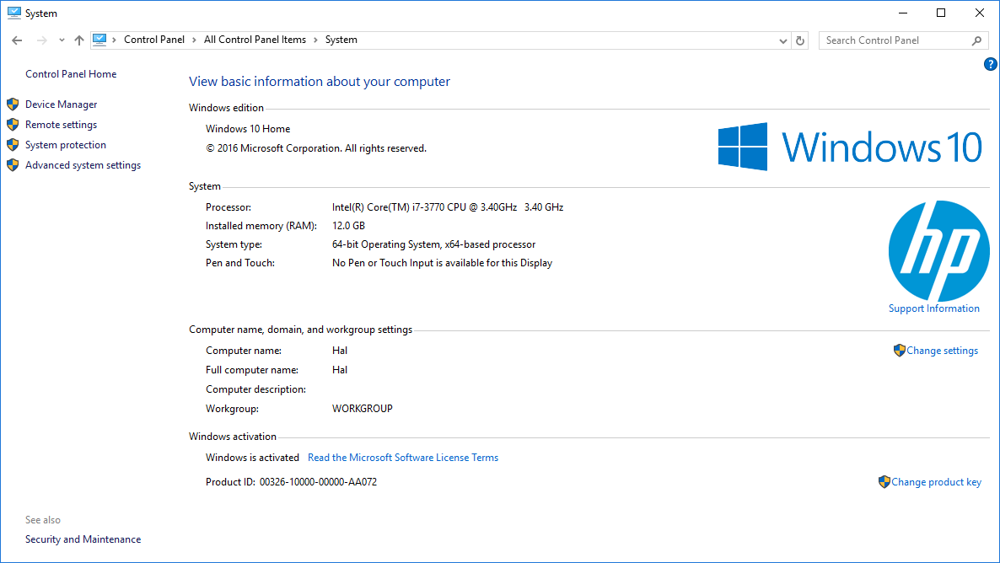
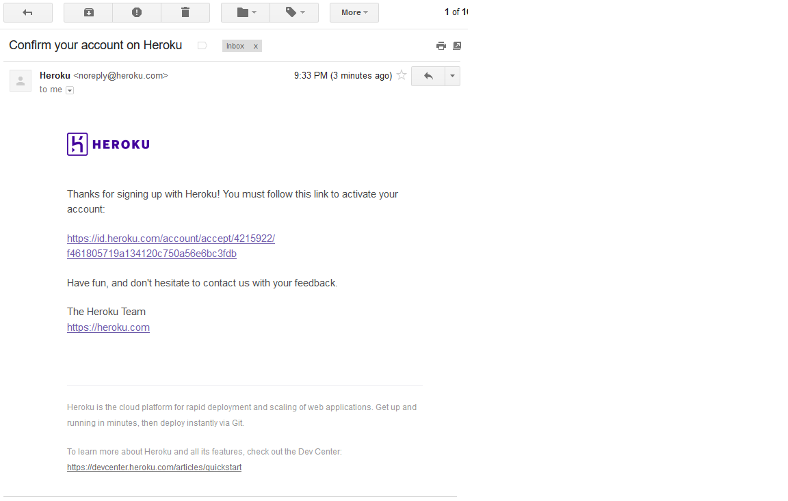
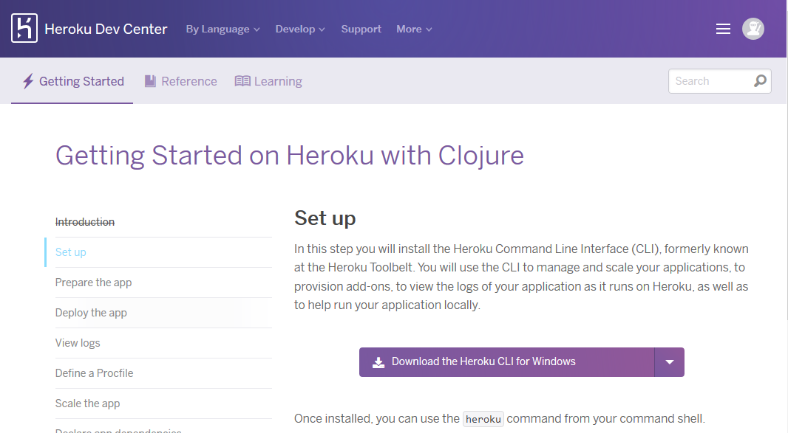

Windows 10 Setup
===============

* Start a command prompt
* Get Java installed
* Get Leiningen installed
* Get Heroku installed (includes Git)
* Test installation

## Starting a command prompt

For these instructions, and for much of the class, you will need to have a command prompt open. This is a text-based interface to talk to your computer. Click the "Windows" button in the bottom left and type "command" in the "Ask me anything" box. Choose the "Command Prompt" desktop app, like in this screenshot:



When you choose "Command Prompt," your screen should look similar to this:



If you have never used the command prompt before, you may want to spend some time [reading up on command prompt basics](http://dosprompt.info/). For the rest of this setup, I will tell you to run commands in your command prompt. When I say that, I mean "type the command into the command prompt and press the Return key."

On other operating systems, the command prompt is called the terminal. We will use the terms terminal, command prompt, and command line interchangably.

## Installing Java

Go to [the Leiningen Windows installer site](http://leiningen-win-installer.djpowell.net/). You should see two links, one for installing Java and another for "leiningen-win-installer." Click the Java link. Then, you should see a screen like the following:


Click the button above "Java Platform (JDK)," as you can see in the above picture. Then you will come to a page that will have the following table on it:


Click the radio button to accept the license agreement, and then download one of the two Windows choices. If you are running 32-bit Windows, choose "Windows x86." If you are running 64-bit Windows, choose "Windows x64."

If you do not know if you are running 32-bit or 64-bit Windows, click the "Windows" button and type "system." Choose "System." (If that does not work, type "Control Panel" and choose "System" from the Control Panel screen.) You should see a window like the following:




You should see if you are running 32- or 64-bit Windows beside "System Type."

Once you have downloaded the right Java version, run the executable you downloaded to install Java. Follow the installation wizard.

## Installing Leiningen

Leiningen is a tool used on the command line to manage Clojure projects.

Next, go back to [the Leiningen Windows installer site](http://leiningen-win-installer.djpowell.net/) and download the file linked as "leiningen-win-installer." Run this executable and follow the "Detailed installation" section at the Leiningen Windows Installer site. At the end of the installation, leave "Run a Clojure REPL" checked before you click "Finish." If a terminal window opens that looks like the one on the Leiningen Windows installer site, then you are good to go.

## Get setup with Heroku

Heroku is the tool we will use in order to put your application online where others can see it.

First, we need to create an account. Go to [Heroku](http://heroku.com) and click the "Sign up" link.


You will be taken to a form where you need to enter your email address in order to sign up. Fill out that form, and you will be sent an email with a link to click to continue the signup process.


After clicking on the link, you will be directed to check your email for a comfirmation messages.


An email from Heroku will contain a link to click which will confirm that the new account is connected to a valid email address.



After clicking on the link in the email, you will be taken to another form where you will need to choose a password. Choose one and enter it twice.


After all that, go [here](https://devcenter.heroku.com/articles/getting-started-with-clojure#set-up) and click "Download the Heroku CLI for Windows"



If you do not see this link on your dashboard, you can download the toolbelt from [toolbelt.heroku.com](https://toolbelt.heroku.com/).

You will download an .exe file. Run this executable to install the Heroku Toolbelt and follow all prompts from the installation wizard.

Now you can login to heroku the first time:

```
clojurista@mylaptop$ heroku login
Enter your Heroku credentials.
Email: clojurista@gmail.com
Password (typing will be hidden): ++++++++
Logged in as clojurista@gmail.com
clojurista@mylaptop$
```
## Testing your setup

You have set up Java, Leiningen, Atom, Git, and Heroku on your computer, all the tools you will need for this program. Before starting, we need to test them out. Make sure you have a command prompt (Windows) open for testing. We will just call this a terminal from now on.

Go to your terminal and run the following command:

`git clone https://github.com/heroku/clojure-sample.git`

This will check out a sample Clojure application from GitHub, a central repository for lots of source code. Your terminal should look similar to this picture:


Then run the command:

`cd clojure-sample`

This will put you in the directory with the source code for this sample bit of Clojure code. After that completes, run:

`lein repl`

This could take a long time, and will download many other pieces of code it relies on. You should see lines that start with `Retrieving ...` on your screen. When it finishes, your terminal should look like the following:


This is starting a REPL, which we will learn about soon. It's a special terminal for Clojure. At the REPL prompt, type `(+  1  1)` and hit enter. Did you get the answer `2` back? You will learn more about that in the course. For now, press the Control button and D button on your keyboard together (abbreviated as Ctrl+D). This should take you out of the Clojure REPL and back to your normal terminal prompt.

We only have one more thing to test, Heroku.

Go back to your terminal. You should still be in the `clojure-sample` directory.

Run this command:

`heroku create`

There should be output about something being created. A URL will be displayed. Look at the following example:


Next, run the following commands:

```
git push heroku master

heroku open
```

Enter "yes" if you are asked if you are sure you want to connect.

Your browser should open (and take a long time to load) and you should see a website like the following:


Congratulations! That website is running code you have on your computer that you have uploaded. You have actually made a very simple Clojure app, and your computer is all set up to make more.

### Try the koans

If you're a track 2 student, try to tackle running the [koans](koans.md).
