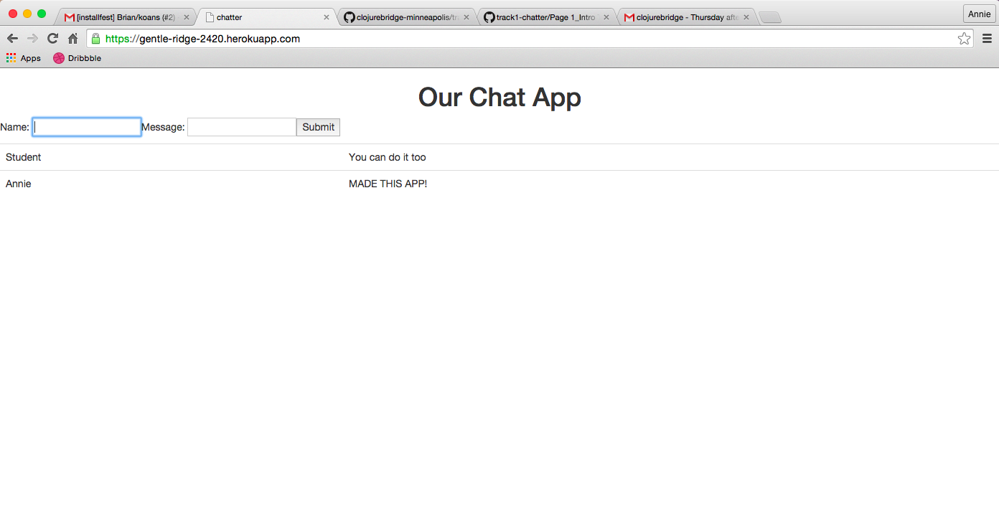

# Chapter 1: ClojureBridge Track 1

## Overview

This curriculum will introduce you to Clojure by creating a web app called Chatter. We will teach you to use the command line, make code changes in LightTable, and push those changes to GitHub so you can share your app with the world.

Each chapter below will work through different concepts of coding and provide Clojure-specific instructions to help you create your app. Review this page, then work your way through each chapter in the table of contents.

## The Chatter App Goals & Tools

### Specific Goal of Workshop

Create a web app using Clojure code.

We will introduce you to Clojure by creating and deploying a web app where you and your friends can post messages to each other.

### Additional Benefits & Learning Opportunities

* Understand HTTP and web basics
* Basic Clojure syntax
* REPL (Read Eval Print Loop)
* Leiningen for project automation
* Git for version control
* Heroku deployment

## README

This is the standard structure of most coding projects. You will have a Readme file that will provide a basic overview of the project and the programs you need to open the project.

### App

In this curriculum we will create a web app, the Chatter app, that displays posted messages.

### Running The Server & Entering Commands in the Terminal

Open a terminal window where you can type in commands (which we'll use in
the next step).
