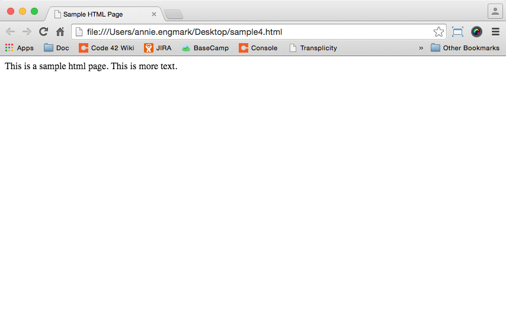
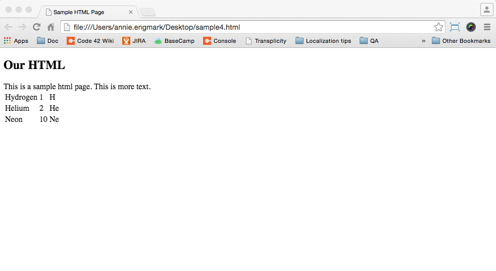

# Chapter 2: Big Picture

### Clojure, the Big Picture

Clojure is a modern Lisp, which is a programming language, with a focus on functional programming. There are lots of programming languages, and Clojure is just one of them. The image below shows similar programming languages grouped by color. Clojure is in the bottom half in the center; it is a dialect of the Common-Lisp language on the far right.


#### Clojure is great because:

* The core language is small and easy to learn.
* The design makes it easy to write correct programs.
* Clojure makes it easier to write concurrent programs -- programs that do more than one thing at a time.
* Clojure programs are fast.
* Clojure programs can build on Java libraries.

Most programmers have to use multiple languages to get their jobs
done.  Web applications often use HTML, CSS, and JavaScript.  We'll
touch on each of those as we build our web app.

### The Web: a basic overview

The Internet is a bunch computers all over the world communicating with
each other using a variety of computer programs.  Some of those programs
are servers that listen for requests and respond with data.

Your web browser is a program that sends requests over HTTP (HyperText Transfer Protocol). Entering, [https://facebook.com](https://facebook.com) into your browser's address bar tells your browser that you want to see that page.

[https://facebook.com](https://facebook.com) is actually a human-readable alias for the numerical address of Facebook's servers.  Since your computer isn't directly connected to Facebook, your computer (through your web browser) asks the computers connected to Facebook to forward the request. This request may be passed through various computers to retrieve the data (web page).

On Linux or a Mac, the command `traceroute` shows you the number of hops request takes to get to Facebook.  (On Windows, the command is called `tracert`.)

On my machine, working from home:
```
clojurista@mylaptop$ traceroute facebook.com
traceroute to facebook.com (157.240.2.35), 30 hops max, 60 byte packets
 1  tl-wr1043nd (10.9.8.1)  0.393 ms  0.460 ms  0.561 ms
 2  96.120.48.9 (96.120.48.9)  7.469 ms  11.688 ms  12.649 ms
 3  te-0-5-0-13-sur02.crosstown.mn.minn.comcast.net (68.86.234.117)  12.796 ms  12.796 ms  12.823 ms
 4  be-1-ar01.roseville.mn.minn.comcast.net (68.87.174.177)  13.680 ms  13.787 ms  13.806 ms
 5  be-13367-cr02.350ecermak.il.ibone.comcast.net (68.86.94.81)  24.275 ms *  24.248 ms
 6  hu-0-17-0-1-pe04.350ecermak.il.ibone.comcast.net (68.86.87.218)  23.276 ms  23.137 ms  23.059 ms
 7  50.248.117.254 (50.248.117.254)  21.843 ms  19.474 ms  21.828 ms
 8  po141.asw03.ord3.tfbnw.net (157.240.33.176)  21.007 ms po141.asw02.ord3.tfbnw.net (157.240.33.174)  18.748 ms po141.asw04.ord3.tfbnw.net (157.240.33.178)  22.339 ms
 9  po203.psw01c.ort2.tfbnw.net (157.240.33.205)  22.329 ms po202.psw01a.ort2.tfbnw.net (157.240.33.193)  21.234 ms po202.psw01b.ort2.tfbnw.net (157.240.33.195)  22.222 ms
10  173.252.67.163 (173.252.67.163)  22.160 ms 173.252.67.77 (173.252.67.77)  20.741 ms 173.252.67.175 (173.252.67.175)  18.836 ms
11  edge-star-mini-shv-01-ort2.facebook.com (157.240.2.35)  19.917 ms  19.859 ms  21.881 ms
clojurista@mylaptop$
```

+ Line 1 is my home router address.
+ Line 2 is my first server from my Internet Service Provider (ISP) Comcast
+ Lines 3-6 is are routers within the Comcast network
* Lines 7-10 are routers on the way towards Facebook
* Line 11 is the Facebook server my browser will communicate with

When you enter [https://facebook.com](httpss://facebook.com) in the
address bar, your browser makes a GET request to the Facebook
server. There are several types of HTTP requests, but GET is the one
that asks the server to send data from a specified resource.  The
server sends back an HTML page and the Web browser turns the HTML into
the web page you see through a process called rendering. You can see
the HTML by right-clicking on the page and selecting `View Page
Source` (on Mac OS X you do **CTRL-click** instead of right-clicking).


### HTML Proper


HTML stands for "HyperText Markup Language".

Hypertext means documents can contain links to other pages or images. The structure of the HTML document is encoded using a markup language consisting of opening and closing elements (also called tags). Each segment of text is formatted according to the type of tag (`<body>`, `<title>`, `<h2>`, etc). Each segment of text needs an opening tag, `<body>`, and a closing tag, `</body>`. The `/` signifies the end of the formatting for that segment.

#### Let's see it in action
Open a text editing program and enter the following text:

```HTML
<!DOCTYPE html>
<html>
  <head>
    <title>Sample HTML Page</title>
  </head>
  <body>
    This is a sample html page.  This is more text.
  </body>
</html>
```

Save the file as 'sample.html'. Then open the file in the web browser. On Windows or a Mac, double-click the file to open it in the default browser, or right-click and select `Open With`. In your browser you should see something like this,



Notice the address bar. Instead of making an HTTP request to a server over the Internet, the browser  opened a local file and displayed the HTML. Remember, the web browser renders the HTML to make it appear as you see it in the browser. Right-click the page and select `View Page Source` to see the HTML elements of the file you saved.

The first line of the source, the DOCTYPE, announces the document is HTML.  The text is enclosed between the _opening_ `<html>` and _closing_ `</html>` tags, or elements.

##### Titles, Headers, & Body Text
Inside the HTML document, we have a `head` and `body`. These are both _elements_ or _tags_. The `head` contains the `title`; in our example it's "Sample HTML Page". The title is the name of the web page. You will see this text as the tab name and when you bookmark the page in your browser. It is not actually a part of the text on the page.

To add a title on the page itself, add it within the `body` of the HTML using a header tag. HTML uses various heading tags to indicate the size of the title or heading. The largest is `<h1>` and the smallest header is `<h6>`.

Let's add some headers to our example. In your text editing file, add `<h2> Our HTML </h2>` in the `body` of the HTML. This will display "Our HTML" as a title. Your text file will look like this:

```html
<!DOCTYPE html>
<html>
  <head>
    <title>Sample HTML Page</title>
  </head>
  <body>
  <h2>Our HTML</h2>
    This is a sample html page.  This is more text.
  </body>
</html>
```


Save the file and refresh the browser. Experiment with different size heading tags from `<h1>` to `<h6>`. Remember to open and close the HTML tags, meaning you must surround the header text with the an opening and closing tag.

##### Tables
HTML supports tables as well. Add a table to your sample HTML by adding the following within the `<body>` tags of the text file:


```HTML
<table>
  <tr>
    <td>Hydrogen</td>
    <td>1</td>
    <td>H</td>
  </tr>
  <tr>
    <td>Helium</td>
    <td>2</td>
    <td>He</td>
  </tr>
  <tr>
    <td>Neon</td>
    <td>10</td>
    <td>Ne</td>
  </tr>
</table>
```



`table` encloses the entire table.

`tr` wraps a table row.

`td` wraps table data, creating a cell within a row.

When you save and refresh the page, you see the table. You might notice it also looks pretty bad. The HTML we've been using describes the basic structure of the document and leaves the display entirely up to the browser. Another language, called CSS, is used so the browser can display the page in a more pleasing way.  We'll touch on CSS later.

The HTML file we have is _static HTML_. The HTML we see in the web browser is simply the code we have written in the text file. Static HTML works great for some kinds of pages, but our page will change depending on the messages people post to it.
So instead of having a file with HTML, we will have a program listening for requests that generate the HTML. As people make requests and post messages, it will generate HTML that reflects the posts.

There's a lot more to HTML, but this gives us enough knowledge for our Chat app.

In the next section, [Chapter 3: Starting the Project](Page_3_Start_project.md), we'll start coding our Chatter app.

#### More HTML Resources

* [Mozilla Developer Network](http://developer.mozilla.org/) is a great source for learning more about html.
* [w3schools.com](http://www.w3schools.com) is another useful resource. Start with the
  * [HTML Introduction](http://www.w3schools.com/html/html_intro.asp).
