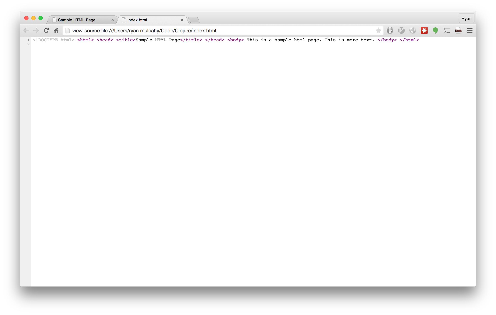

# Chapter 3: Starting The Project

### Creating a Clojure project

We're going to start by asking Leiningen to start a web application for us.

```
  $: lein new compojure chatter
```


`lein` is a tool for managing Clojure projects.

The command above requests permission to create a new compojure project called "Chatter". This command results in the creation of a directory`chatter` which appears as a folder in your computer's directory (Finder on Mac, Windows Explorer on Windows)

In the terminal, move into the project "Chatter" directory by entering,

```
  $: cd chatter
```

Start the server with this command

```
  $: lein ring server
```

`lein` will download a bunch of stuff from the Internet the first time it runs. After this finishes, your default browser opens a page that says, "Hello World".

Notice the address bar.

* "localhost" is an alias for your computer.

* 3000 is the port number where your server is listening for requests.

In the web browser, right-click and select `View Page Source`. You see that it's not even an HTML document, it's just the _string_ "Hello World".

In the terminal you see the message, "Started server on port 3000". This means your server is working and you will be able to view your app in the browser. We initiated this connection earlier when we entered `lein ring server` in the command line.

You can stop the server connection by hitting "Ctrl + C" in the command line. If you try this, be sure to start the server back up again so we can use it later.

Let's take a closer look at what's in the chatter directory. In your editor it looks like this:

```
.
├── project.clj
├── README.md
├── resources
│   └── public
├── src
│   └── chatter
│       └── handler.clj
└── test
    └── chatter
        └── handler_test.clj

6 directories, 4 files
```

`project.clj` is a Clojure file that describes what our project does and what other programs it needs to run.

`README.md` is a _markdown_ file (.md), which describes the program's prerequisites, how to run the program, and the license.

`resources` is a folder where you store static HTML, CSS, and images.

`src` is where the source code lives.

`test` is where the tests are stored. (A best-practice method is to test the directory before starting the project -- we will skip this step in this tutorial.)

### A closer look at the src directory

In the editor, open the file `src/chatter/handler.clj`.

The file that ends with ".clj" indicates this is a Clojure file. Clojure programs are made up of _expressions_. Expressions are either a single name, number, string, or a list of expressions beginning with a paren (or parenthesis). These expressions make your app appear and function in a web browser.


In the `src/chatter/handler.clj` file, the first expression `(ns chatter.handler ...` tells Clojure what we want to call the namespace (ns) being defined in this file. In this case we want to call it "chatter.handler".

The sub-expression, the expression below, begins with `(:require ...`. This is importing the ring and compojure libraries. Those are low-level Clojure libraries for building web apps.

The second expression is `(defroutes app-routes ...`. _defroutes_ is specific to Clojure web apps.  It creates a set of routes and gives them the name `app-routes`.  The expressions after symbol `app-routes` are the route definitions. There are two here.

The first is:

```clojure
(GET "/" [] "Hello World")
```

There are four parts to this expression:

1. `GET`: this is the type of HTTP request we want to handle. GETs are requests for information or data.
2. `"/"`: this is the name of the web page.  `/` means the top level.
3. `[]`: this is an empty parameter vector.  When you do a search or fill out a form, the parameters narrow the result.
4. `"Hello World"`: the result that gets sent back to the requesting browser.

After the GET request is the second route definition `app-route`, which is:

```clojure
(route/not-found "Not Found")
```

This means when the server gets any kind of request other than GET, it should return "Not Found."

In your browser, right-click on the page and select `Inspect Element` (on Mac OS X you do **CTRL-click** instead of right-clicking).



The `HTML` tab shows what the HTML document looks like. The default is an empty head and a body with the string "Hello World". This is different from what we saw when we used `View Page Source`. The
browser requested html but only got a string back, and it fleshes out a legal page from this information.

Click on the `Network` tab and refresh the page. You see the request is actually a GET request and the response contained a status code of 200 -- that indicates the request was successful.

In your browser address bar, type
`http://localhost:3000/non-existent-page`. Now you see the GET request is in red and has a status of 404, which indicates that the server couldn't find the page. This was handled by the line,

```clojure
(route/not-found "Not Found")
```

In the editor, the third and final expression of the `handler.clj` file says,

```clojure
(def app ...
```

`def` is how you declare a variable in Clojure.
The format is: `(def name doc-string? init?)`

1. `def`: introduces the def expression.
2. `name`: the name you want to give the variable.
3. `doc-string?`: an optional description on what the variable is and how it is meant to be used.
4. `init?`: an optional value the variable will be set to. If unset, the variable is unbound.

The _name_ of the variable is `app` and it's being assigned the result of ```(wrap-defaults app-routes site-defaults)```

* `wrap-defaults` is imported from the ring library, and it combines our routes and the defaults. When we start the server, it's going to look for the routes associated with the `app` variable and use those to decide how to handle HTTP requests.
* `app-routes` is what we're calling our set of routes
* `site-defaults`are default request/response handling details imported into the namespace from ring library.


Stop the server by going back to the terminal and holding the "Ctrl+C".

### git

Since we haven't made any changes yet, this is a good time to put the code under version control.  Version control allows developers to keep track of their changes over time. It makes it easy to experiment and coordinate work with others.

In the Chatter directory, enter the command:

    $: git init
    Initialized empty Git repository in /home/crk/chatter/.git/

Now git is monitoring our directory. Verify the status of our directory by entering,

    $: git status

    On branch master

    Initial commit

    Untracked files:
      (use "git add <file>..." to include in what will be committed)

	.gitignore
	README.md
	project.clj
	src/
	test/

    nothing added to commit but untracked files present (use "git add" to track)

We're on the master branch. The master branch is the main place where our code will be.  It says "Initial commit" because we're just initializing git. Git doesn't know anything about the files in our project, but it has spotted the `README.md` and `project.clj` files as well as the src and test directories. It also spotted a file called
`.gitignore`. Files beginning with a dot are normally hidden unless you specifically ask to see them. `.gitignore ` is a special file; it tells git what kind of files we don't want git to track.  These will mostly be compiled code, test reports, and log files.

Git follows a two-step process.  First you add the changes; they become staged.  Then, you commit all of the staged changes.  Let's add everything. Enter the following in the command line:

    $: git add .

The "." tells git the current directory and below. We are telling git to add all of the Chatter files to the master branch.

Now when we ask git for the status:

    $: git status
    On branch master

    Initial commit

    Changes to be committed:
      (use "git rm --cached <file>..." to unstage)

	new file:   .gitignore
	new file:   README.md
	new file:   project.clj
	new file:   src/chatter/handler.clj
	new file:   test/chatter/handler_test.clj

All of our stuff is ready to be committed. That requires a commit message. After `-m` enter a short message that will help you identify the changes in this commit.

    $: git commit . -m "initial commit"
    [master (root-commit) 44a560f] initial commit
    5 files changed, 66 insertions(+)
    create mode 100644 .gitignore
    create mode 100644 README.md
    create mode 100644 project.clj
    create mode 100644 src/chatter/core/handler.clj
    create mode 100644 test/chatter/core/handler_test.clj

Now when we ask git for the status:

    $: git status
    On branch master
    nothing to commit, working directory clean

There haven't been any changes since our last commit, so there's nothing to see. Let's check the log.

    $: git log
    commit 44a560f1653770afac01aea2c9279a7af46a46eb
    Author: crkoehnen <crkoehnen@gmail.com>
    Date:   Sun Dec 28 16:43:37 2014 -0600

        initial commit


We see there's been one commit, the commit hash (which uniquely identifies every commit), the author's name, the date, and the commit comment.

By keeping track of changes, git makes it easy to go back to an earlier point -- you are creating different versions of the file. By itself, it won't do much if our hard drive suddenly dies. But git allows you to have repositories on other computers, so if your computer dies, your code lives on. GitHub is a company hosting source code; it's free if you don't mind that other people can see your code. As a safety measure, and for version control, we will put our code on GitHub.

Log into [https://github.com](https://github.com) and click, "create repository" (the "+" sign on the top menu). Name it "Chatter". That will open a page for your new repository. We want to push an existing repository, enter the following:

NOTE: be sure to use the url that GitHub gives you, not the one listed.

    $: git remote add origin https://github.com/crkoehnen/chatter.git
    $: git push -u origin master
    Username for 'https://github.com': crkoehnen
    Password for 'https://crkoehnen@github.com':
    Counting objects: 13, done.
    Delta compression using up to 4 threads.
    Compressing objects: 100% (7/7), done.
    Writing objects: 100% (13/13), 1.54 KiB | 0 bytes/s, done.
    Total 13 (delta 0), reused 0 (delta 0)
    To https://github.com/crkoehnen/chatter.git
    * [new branch]      master -> master
    Branch master set up to track remote branch master from origin.

Back on GitHub, click on the "Chatter" link and you'll go to the main page for the repository. Note there is a single commit and the text is identical to what's in our `README.md` file.


### Workflow

Now we're going to start changing the templated code to make it our web app. We're going to follow a certain workflow:

1. write some code
1. try the code
1. repeat 2-3 times until we're happy with the changes
1. commit the changes
1. push the changes to GitHub

In [Chapter 4](Page_4_Change_code.md) we will change the code, then commit and merge the changes and push to GitHub.
