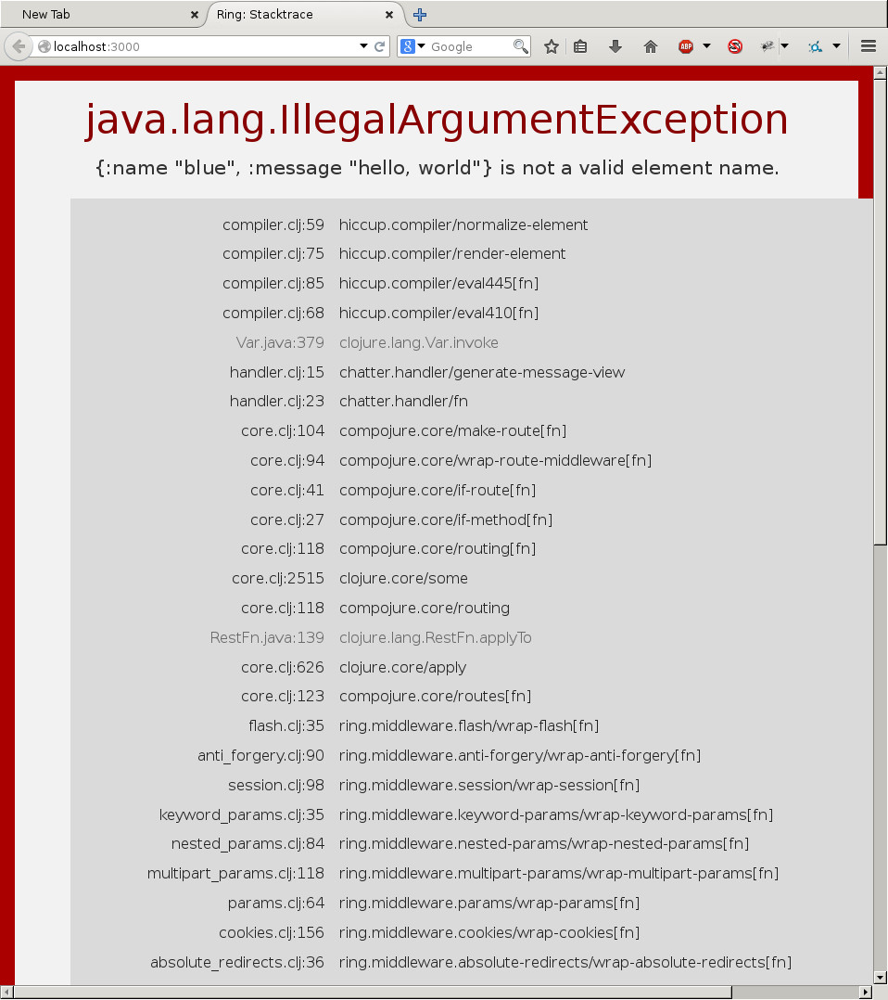
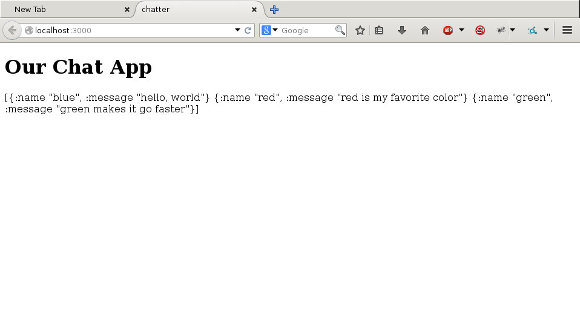
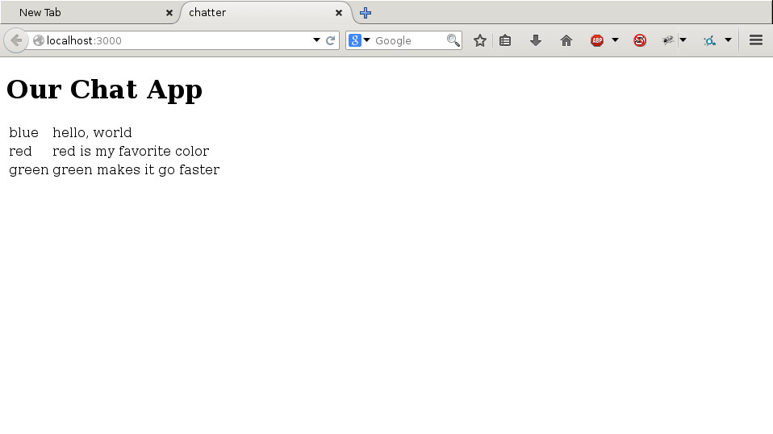
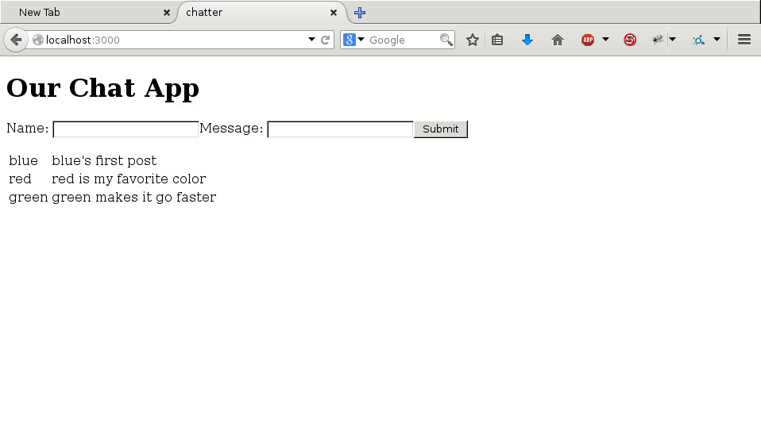

# Chapter 5: More Code Changes

Now let's change the app's main page from "Hello, World" to something a little more chatty.

### Adding Hiccup

We need to write code that will generate HTML. To do this, we will use a library called `hiccup`. A library is a separate set of functions that we can add to our program. We don't have this library yet, so we're going to add it. Adding a new library requires two steps:

1) Add the library to the dependency section of the `project.clj` file. This tells lein your program needs another program.

Add hiccup by updating the `project.clj` file to look like this
(in fact we're updating a bunch of old libary versions here):

```clojure
(defproject chatter "0.1.0-SNAPSHOT"
  :description "clojure web app for displaying messages"
  :url "http://example.com/FIXME"
  :min-lein-version "2.0.0"
  :dependencies [[org.clojure/clojure "1.8.0"]
                 [compojure "1.5.1"]
                 [ring/ring-core "1.5.0"
                  :exclusions [org.clojure/tools.reader]]
                 [ring "1.5.0"]
                 [ring/ring-jetty-adapter "1.5.0"]
                 [ring/ring-defaults "0.2.1"]
                 [hiccup "1.0.5"]
                 [hickory "0.7.0"]
                 [environ "1.1.0"]]
  :plugins [[lein-ring "0.9.7"]
            [lein-environ "1.0.0"]]
  :ring {:handler chatter.handler/app
         :init chatter.handler/init
         :destroy chatter.handler/destroy}
  :aot :all
  :main chatter.handler
  :profiles
  {:dev
   {:dependencies [[javax.servlet/servlet-api "2.5"]
                   [ring/ring-mock "0.3.0"]]}
   :production
   {:ring
    {:open-browser? false, :stacktraces? false, :auto-reload? false}
    :env {production true}}}
  :uberjar-name "chatter-standalone.jar")
```

2) Import the library into the namespace you will use it in by adding the import to the `ns` declaration. Our ns declaration will be part of the `handler.clj` file:

```clojure
(ns chatter.handler
  (:require [compojure.core :refer :all]
            [compojure.route :as route]
            [ring.middleware.defaults :refer [wrap-defaults site-defaults]]
            [hiccup.page :as page]))
```

Let's use hiccup to generate the html by changing `app-routes`:


```clojure
(defroutes app-routes
  (GET "/" []
       (page/html5
        [:head
         [:title "chatter"]]
        [:body
         [:h1 "Our Chat App"]]))
  (route/not-found "Not Found"))
```

Once the code is updated, let's try it out. In the command line, start the server:

    $: lein ring server

Now `http://localhost:3000` displays "Our Chat App".  Right-click and select `View Page Source` to see  it's now proper HTML complete with `head`, `title`, and `body`.

The hiccup function `page/html5` generates an HTML page. It expects Clojure vectors with symbols representing corresponding HTML tags. Hiccup will automatically add the closing tag when it reaches the end of the vector.

Compare the hiccup to HTML in `View Page Source` to the HTML we wrote by hand earlier.

#### How Does Hiccup Work?

>_Vectors_ are a Clojure data structure used to contain sequences of things, including other vectors. Vectors are often written using square brackets. For example, `[1 2 3]` is a vector containing the numbers 1, 2, and 3. Hiccup uses vectors of keywords to represent sections of HTML.

>_Keywords_ are names that begin with a colon.  `:title`, `:x`, and `:favorite-color` are all keywords. Clojure often uses keywords where other languages use strings. If you were to use Clojure to query a database, Clojure would probably use keywords to represent the column names.  Hiccup uses keywords to represent the names of HTML elements.

> Where HTML uses `<body>`, hiccup would expect `:body`. Where HTML uses `<title>`, hiccup uses
> `:title`. Because the keywords are enclosed in a vector, the closing of the HTML tag is unnecessary.  The closing of the surrounding vector signals where the HTML section ends.

A problem with our new `app-routes` is that it has two different functions right now. Its main role is to take the incoming request and decide what to do.  Right now it's doing that, but it is also generating a full HTML page. As we add more pages, this will become too complicated to manage. We'll get ahead of the game by splitting out the task of generating the HTML into a helper function.

Clojure defines a function using this syntax:

 ```clojure
 (defn name
   doc-string?
   params-vector
   expression)
 ```

 1. `defn` - introduces the defn expression.
 2. `name` - what you call the function.
 3. `doc-string?` - an optional description of the function.
 4. `params-vector` - a vector of symbols naming the functions arguments.
 5. `expression` - the body of the function.

 `hello-world`, a traditional first function, might be programmed in Clojure like:

 ```clojure
 (defn hello-world
   "ye olde 'Hello, World'"
   []
   "Hello, World")
 ```

 `hello-world` takes no arguments and returns the string "Hello, World".

 `
 user> (hello-world)
 "Hello, World"
 `

Our new code should look like:

```clojure
(defn generate-message-view
  "This generates the HTML for displaying messages"
  []
  (page/html5
   [:head
    [:title "chatter"]]
   [:body
    [:h1 "Our Chat App"]]))
(defroutes app-routes
  (GET "/" [] (generate-message-view))
  (route/not-found "Not Found"))
```

`generate-message-view` is a function that takes no arguments. It calls a hiccup function `page/html5` to generate html from a vector representing the `head` sections and a vector representing the `body` elements of the html.

Save `handler.clj`, and refresh the browser to make sure our page still works. From the outside, we shouldn't see a change. The page should still display "Our Chat App" and the html should be identical. Now, let's double check our git status:


    $: git status
    On branch master
    Changes not staged for commit:
       (use "git add <file>..." to update what will be committed)
       (use "git checkout -- <file>..." to discard changes in working directory)

          modified:   project.clj
          modified:   src/chatter/core/handler.clj

    no changes added to commit (use "git add" and/or "git commit -a")

That looks right so [add, commit, and then push to GitHub](Page_4_Change_code.md#pushing-to-github).

### Adding Messages

Our app is not displaying messages, nor do we have a way of adding messages. Let's make that happen now.

Let's change the app so it displays messages. We'll represent the messages as a vector of maps. Each map will have a `:name` and `:message` key and the corresponding value, in quotes.  For example, the code below will represent blue's first post.

```clojure
{:name "blue" :message "blue's first post"}
```

This is a map with two keys:
* `:name` is "blue", because blue posted it
* `:message` is the content of the post and its value is "blue's first post"

Programs often need to associate keys with values and the usual data structure for doing that are hash tables. Clojure calls them maps and they look like this:

```clojure
(def cities
  {"Tokyo" 37900000
   "Delhi" 26580000
   "Seoul" 26100000})
```

Here `cities` is a hash table whose _keys_ are strings (in this case the names of cities) and the _values_ are the populations of each city.

To get a value from a map, pass the map and key into the `get` function. For example,

```clojure
(get cities "Tokyo")
```
returns `37900000`. When the keys are keywords, you can also use the keyword as a function that takes the map and returns the values.

```clojure
(:name {:name "blue" :message "blue's first post"})
```
returns `"blue"`.

```clojure
(:message {:name "blue" :message "blue's first post"})
```
returns `"blue's first post"`.

Maps are everywhere in Clojure and are used for keeping track of collections of things.

Let's call the vector simply `chat-messages` and start with some sample messages to get started. Add a chat-messages variable to `handler.clj`.

After the ns expression, add:

```clojure
(def chat-messages [{:name "blue" :message "hello, world"}
                    {:name "red" :message "red is my favorite color"}
                    {:name "green" :message "green makes it go faster"}])
```

Next, we'll modify the HTML to display the messages.  We will also add a parameter to the `generate-message-view` function so that we can give it a messages we want displayed.

```clojure
(defn generate-message-view
  "This generates the HTML for displaying messages"
  [messages]
  (page/html5
   [:head
    [:title "chatter"]]
   [:body
    [:h1 "Our Chat App"]
    [:p messages]]))
(defroutes app-routes
  (GET "/" [] (generate-message-view chat-messages))
  (route/not-found "Not Found"))
```

Save `handler.clj` and refresh the browser.

This blows up spectacularly.



This is a stack trace - it gives us an idea what the program was doing when it hit the problem. Ignore all the files that aren't ones you wrote for the project. In my case, the first file of interest is
`handler.clj`, line 14, the `generate-message-view` function.

The exception message on the top, `"... is not a valid element name"`, is a clue to what's wrong.  Elements are what fragments of html are called.  Hiccup is responsible for generating html from Clojure symbols. The problem is that we've got a map with symbols in it and hiccup thinks they're html.  They're not, so it creates an error.

We can fix the issue by converting our maps to strings.

```clojure
(defn generate-message-view
  "This generates the HTML for displaying messages"
  [messages]
  (page/html5
   [:head
    [:title "chatter"]]
   [:body
    [:h1 "Our Chat App"]
    [:p (str messages)]]))
```

Save `handler.clj`, and refresh the browser.

This fixes the exception but it's ugly.



Let's take the messages and put them in a table using HTML's `table`, `tr`, and `td` elements.  We're going to write a function that takes a
message and creates an HTML row. Then, inside a `table`, we're going to apply that function to all of our messages.


Clojure uses `defn` to create a function, but those functions are named. Sometimes, we want a specialized function that isn't reusable. For those cases, Clojure has a way of creating an anonymous function.

```clojure
(fn params-vector expression)
```

Our function is going to take a message, we'll call it "m" within the function, and extract both the `:name` and `:message`, wrapping them in `:td` to make table cells and putting them both within a `:tr` to make the row.  Since the keys to
the message hashmap are keywords, we can use them as functions to get the values.  In Clojure, the function looks like:

```clojure
(fn [m] [:tr [:td (:name m)] [:td (:message m)]])
```

Making a new collection by applying a function to all of the elements of an existing collection is such a common thing that Clojure has it functionality predefined. It's a function called `map`. This is different than "mapping" (the function) over a collection of maps (hash tables), which is what we are doing.

The syntax is:

 ```clojure
 (map fn coll)
 ```

> `map` - signifies that we're going to be invoking the map function.
>
> `fn` - the function we're going to apply to every element.
>
> `coll` - the collection containing the elements.

Mapping our anonymous function over our vector of messages looks like:

```clojure
(map (fn [m] [:tr [:td (:name m)] [:td (:message m)]]) messages)
```

Now our `generate-message-view` looks like:

```clojure
(defn generate-message-view
  "This generates the HTML for displaying messages"
  [messages]
  (page/html5
     [:head
    [:title "chatter"]]
   [:body
    [:h1 "Our Chat App"]
    [:p
     [:table
      (map (fn [m] [:tr [:td (:name m)] [:td (:message m)]]) messages)]]]))
```

Save `handler.clj`, then refresh the browser.  Our hard-coded messages should now display in the page.




### Forms

We still don't have a way of adding new messages. This requires HTML forms and importing the form functions from hiccup. The form allows the user to send messages in the parameters of an HTML `POST`. We will need to extract the message and add it to our collection of messages. This will be the most complicated set of changes in our app.


> In HTML, a `form` is used to send input from the browser to the server. The `form` element contains a pair of attributes.
>
> `action` - which specifies the route that should handle the input.
>
> `method` - which specifies the type of request.

Up until now, we've only used `GET` to show the messages. To send messages, we'll need to add a `POST`.

> `forms` contain text and `input` elements. The `input` elements define the content the `form` will send to the server. `input` elements have a number of attributes:
>
> `id` - a way of identifying the input
>
>`name` - the name of the input
>
> `type` - the kind of input
>
> `value` - the default value for the input

We're going to use hiccup to generate html that looks like,

```html
<form action="/" method="POST">
  Name: <input id="name" name="name" type="text">
  Message: <input id="msg" name="msg" type="text">
  <input type="submit" value="Submit">
</form>
```

First, we need to import some libraries into our `handler.clj` file.  Add:

```clojure
[hiccup.form :as form]
```

to the `:require` section of the `ns` declaration.  It should now look like:

```clojure
(ns chatter.handler
  (:require [compojure.core :refer :all]
            [compojure.route :as route]
            [ring.middleware.defaults :refer [wrap-defaults site-defaults]]
            [hiccup.page :as page]
            [hiccup.form :as form]))
```

Now that we have imported the hiccup form function, we can use it to generate the HTML form.

```clojure
(form/form-to
 [:post "/"]
 "Name: " (form/text-field "name")
 "Message: " (form/text-field "msg")
 (form/submit-button "Submit"))
```

`form/form-to` is a hiccup function for generating the form.

`[:post "/"]` is a vector with the keyword `:post` and the string "/". This tells hiccup to make the method a `POST` to the `/` location.

`"Name: "` is a string that will be the text displayed before the input field.

`form/text-field` is a hiccup function for generating an input field of type "text". We're passing in the string "name".

`"Message: "` is a string that will be the text displayed before the input field.

`form/submit-button` is a hiccup function for generating the submit button.

We want to generate the form button below the title but above the list of messages in the `generate-message-view` function.

Finally, we're going to change our definition of the app

from:

```clojure
(def app
  (wrap-defaults app-routes site-defaults))
```

to:

```clojure
(def app app-routes)
```

This is a simplification for the tutorial.

Now our code looks like:

```clojure
(ns chatter.handler
  (:require [compojure.core :refer :all]
            [compojure.route :as route]
            [ring.middleware.defaults :refer [wrap-defaults site-defaults]]
            [hiccup.page :as page]
            [hiccup.form :as form]))

(def chat-messages [{:name "blue" :message "blue's first post"}
                    {:name "red" :message "red is my favorite color"}
                    {:name "green" :message "green makes it go faster"}])

(defn generate-message-view
  "This generates the HTML for displaying messages"
  [messages]
  (page/html5
   [:head
    [:title "chatter"]]
   [:body
    [:h1 "Our Chat App"]
    [:p
     (form/form-to
      [:post "/"]
      "Name: " (form/text-field "name")
      "Message: " (form/text-field "msg")
      (form/submit-button "Submit"))]
    [:p
     [:table
      (map (fn [m] [:tr [:td (:name m)] [:td (:message m)]]) messages)]]]))

(defroutes app-routes
  (GET "/" [] (generate-message-view chat-messages))
  (POST "/" [] (generate-message-view chat-messages))
  (route/not-found "Not Found"))

(def app app-routes)
```

Save `handler.clj` and refresh the browser. We should now have a form on the page where a user could submit a new message.




### Wiring the form

We see the form now, but submitting it does nothing. The problem now is that we're extracting the params during the `POST` but aren't actually doing anything with them.  To fix this, we have to extract the parameters from the form, build a message, and store the message in our
messages vector. This might be the hardest part of our app.

First, we need to import a library to extract the information sent by the form. Add the following to the ```:require``` section,

`[ring.middleware.params :refer [wrap-params]]`

Next, change the `app` definition from:

```clojure
(def app app-routes)
```

to:

```clojure
(def app (wrap-params app-routes))
```

This enables us to have access to the information sent back in our `form`.

We want to be able to add new messages to our `messages` vector. Clojure was designed from the ground up to make it easier to write concurrent programs. Concurrent programs are programs that do more than one thing at a time. It does that by having data structures that do not change. Variables can be changed to point to something else, but Clojure requires that doing so happens using particular functions, so it can ensure the program stays in a safe state. We're going to use the `atom` mechanism to allow us to update our `messages`.


> An `atom` is like a box that protects information from being changed in an unsafe way. You simply pass the information into the `atom`.

Instead of having the `chat-messages` variable point to our vector of messages, we're going to have it point to the `atom` protecting the vector.

Instead of:

```clojure
(def chat-messages [{:name "blue" :message "blue's first post"}
                    {:name "red" :message "red is my favorite color"}
                    {:name "green" :message "green makes it go faster"}])
```

We'll use:

```clojure
(def chat-messages
     (atom [{:name "blue" :message "blue's first post"}
            {:name "red" :message "red is my favorite color"}
            {:name "green" :message "green makes it go faster"}]))
```

Now `chat-messages` is pointing to the `atom` protecting our vector of hashes.

Because `chat-messages` is pointing to the `atom`, we can't simply `map` over it in `generate-message-view`.  Now, we have to tell Clojure that we want to generate HTML for the contents of the atom. This allows Clojure to ensure the messages are always read in a consistent
state, even though something could be modifying them.

> Reading what's stored in an `atom` is called "dereferencing" and is represented by the `@` character.

We will dereference the `chat-messages` atom just before it is passed to the `generate-message-view` function. We can do this by changing our routes from:

```clojure
(defroutes app-routes
  (GET "/" [] (generate-message-view chat-messages))
  (POST "/" [] (generate-message-view chat-messages))
  (route/not-found "Not Found"))
```

to:

```clojure
(defroutes app-routes
  (GET "/" [] (generate-message-view @chat-messages))
  (POST "/" [] (generate-message-view @chat-messages))
  (route/not-found "Not Found"))
```

If you save `handler.clj` and refresh the browser, the hard coded examples should display as before. We still won't see any new messages because we still need to extract the information from the form and modify `chat-messages`.

To add messages to `chat-messages`, we will need to introduce two more functions: `conj` and `swap!`.

> #### conj
> There are many ways to work with collections of values in Clojure.  One commonly used function is `conj`. The name is short for "conjoin". This function takes a collection and one or more item(s) to add to the collection. It then returns a _new_ collection without modifying the original collection.
>
> ```clojure
> (conj [:one :two] :three)
> => [:one :two :three]
>
> (conj [:one :two :three] :four :five)
> => [:one :two :three :four :five]
> ```

> #### swap!
> To modify an `atom`, Clojure provides `swap!`.
>
> ```clojure
> (swap! atom update-function arguments...)
> ```
>
> `atom` - the atom to be updated.
> `update-function` - the function that is applied to the value protected by the atom. It returns a new value which will replace the original.
>
> `arguments...` - zero or more arguments to be passed to the `update-function`.
>
> The `swap!` function will:
>  1. Dereference the atom
>  2. Pass this dereferenced value to the `update-function` along with any additional arguments. You can think of it like this: `(update-function @atom arguments...)`
>  3. Safely replace the inner content of the atom with the value returned from the `update-function`, and finally...
>  4. Return the new content of the atom.
>
> ```clojure
> (def a-number (atom 1))
>
> @a-number
> => 1
> (swap! a-number + 2)
> => 3
> @a-number
> => 3
> ```

In our case, we're going to "swap" the content of ```chat-messages``` by
"`conj`ing" a new message onto the vector of messages.

We'll also put it in a helper function to make it easier to maintain.

```clojure
(defn update-messages!
  "This will update a message list atom"
  [messages name new-message]
  (swap! messages conj {:name name :message new-message}))
```

Now, we have to modify our `app-routes`. We have to make two changes; it needs to extract the form information when somebody `POST`s a new message, and it needs to add the new message to our `chat-messages` before returning the page to the user. Both of these changes need to happen in the `POST` route.

The new `app-routes` looks like

```clojure
(defroutes app-routes
  (GET "/" [] (generate-message-view @chat-messages))
  (POST "/" {params :params} (generate-message-view
                               (update-messages! chat-messages
(get params "name") (get params "msg"))
                               ))
  (route/not-found "Not Found"))
```
1. `{params :params}` is a shorthand notation that tells Clojure to extract all of the data submitted from the HTML form and call that data `params`.
2. `(get params "name")` and `(get params "msg")` extract the values of the "name" and "msg" fields from the form data.
3. The `update-messages!` function is then called with the `chat-messages` atom and the values of the "name" and "msg" fields from the form.
4. After `update-messages!` has added the new message to the inner content of `chat-messages` it returns the new, dereferenced, vector of messages held by the atom.
5. `generate-message-view` is called with the updated collection of messages and builds the HTML response for the user.

Another way of writing this, which may make the intent more clear, is to name some of the intermediate values using `let`. This will allow us to temporarily provide names for the results of some of the expressions.

```clojure
(defroutes app-routes
  (GET "/" [] (generate-message-view @chat-messages))
  (POST "/" {params :params}
    (let [name-param (get params "name")
          msg-param (get params "msg")
          new-messages (update-messages! chat-messages name-param msg-param)]
      (generate-message-view new-messages)
      ))
  (route/not-found "Not Found"))
```

1.  Extract the "name" field from the form data in `params` and name it `name-param`.
2.  Extract the "msg" field from the form data in `params` and name it `msg-param`.
3.  Execute the `update-messages!` function for the chat-messages atom and the values of the previously established `name-param` and `msg-param` names.
4.  Assign the name `new-messages` to the result of `update-messages!`.
5.  Execute `generate-message-view` for the new collection of messages now called `new-messages`.
6.  Return the HTML produced by `generate-message-view` and forget about the names `name-param`, `msg-param`, and `new-messages`.

> #### let
> `let` expressions are used to temporarily associate names with the results of other expressions, similar to how a function assigns names to its arguments. These named values can also be re-used without the cost of re-evaluating the expression that generated them.
>
> (let [name-one expression-one]
>       name-two expression-two]
>   (some-function name-one name-two))
>
> 1. `name-one` - a name for the result of evaluating `expression-one`.
> 2. `name-two` - a name for the result of evaluating `expression-two`.
> 3. Call `some-function` and pass it the values assigned to `name-one` and `name-two`.
> 4. Return the result of the last expression within the `let`, and forget about the names we had created.
>
> ```clojure
> (let [two   2
>       three (+ two 1)]
>   (* two three))
> => 6
> ```

Save the `handler.clj` file, we will be able to use the form to add messages to the page.

Since we can add messages through the form, we can remove our hard-coded messages. Change the messages to an empty vector.

```clojure
(def chat-messages (atom []))
```

Now, the app is taking our new messages, but it's adding new messages to the end. That's going to be hard to read.  We can fix that by changing from a vector to a list.


```clojure
(def chat-messages (atom '()))
```

> Like vectors, lists are sequential collections.  Vectors are better for accessing random elements fast (which we aren't doing). Lists are better at adding an element to the front, which we want to do. Since they are both collections, `conj` works with either.

Our app now looks like:


```clojure
(ns chatter.handler
  (:require [compojure.core :refer :all]
            [compojure.route :as route]
            [ring.middleware.defaults :refer [wrap-defaults site-defaults]]
            [ring.middleware.params :refer [wrap-params]]
            [hiccup.page :as page]
            [hiccup.form :as form]))

(def chat-messages (atom '()))

(defn generate-message-view
  "This generates the HTML for displaying messages"
  [messages]
  (page/html5
   [:head
    [:title "chatter"]]
   [:body
    [:h1 "Our Chat App"]
    [:p
     (form/form-to
      [:post "/"]
      "Name: " (form/text-field "name")
      "Message: " (form/text-field "msg")
      (form/submit-button "Submit"))]
    [:p
     [:table
      (map (fn [m] [:tr [:td (:name m)] [:td (:message m)]]) messages)]]]))

(defn update-messages!
  "This will update a message list atom"
  [messages name message]
  (swap! messages conj  {:name name :message message}))

(defroutes app-routes
  (GET "/" [] (generate-message-view @chat-messages))
  (POST "/" {params :params}
    (let [name-param (get params "name")
          msg-param (get params "msg")
          new-messages (update-messages! chat-messages name-param msg-param)]
      (generate-message-view new-messages)
      ))
  (route/not-found "Not Found"))

(def app (wrap-params app-routes))
```

[Add, commit, push to GitHub](Page_4_Change_code.md#pushing-to-github)

### Bootstrap

The app is working but is ugly. We can improve it by using CSS and JavaScript from a package of software called Twitter Bootstrap.

In the head section of our HTML, we're going to include Bootstrap:

```clojure
   [:head
    [:title "chatter"]
    (page/include-css "//maxcdn.bootstrapcdn.com/bootstrap/3.3.1/css/bootstrap.min.css")
    (page/include-js  "//maxcdn.bootstrapcdn.com/bootstrap/3.3.1/js/bootstrap.min.js")]
```

[Start the server again](Page_3_Start_project.md#creating-a-clojure-project), and you will see the fonts change. You'll also notice the table get smashed together.

Now, let's change the table element from `:table` to `:table#messages.table`.

```clojure
    [:table#messages.table
     (map (fn [m] [:tr [:td (:name m)] [:td (:message m)]]) messages)]
```

This tells hiccup that we want the table to have an id of `messages` and a class of `table`. CSS works by looking for combinations of classes and structure and changing the appearance when an element matches a pattern. Bootstrap uses a set of predefined CSS to look for a common set of classes. One of them is table.

Save the file, then refresh the browser. It now looks better. Examine the HTML that's generated. You see an id and class field inside the table element.

Let's make the table entries stripped by adding an additional class. Change the table element to `:table#messages.table.table-striped`.

```clojure
    [:table#messages.table.table-striped
     (map (fn [m] [:tr [:td (:name m)] [:td (:message m)]]) messages)]
```


What do you think will happen if you change `table-striped` to `table-bordered`? Try it and refresh your browser to find out!

HTML elements can have multiple classes and CSS uses this to create more complex effects. Try adding `table-hover` to the table element: `:table#messages.table.table-bordered.table-hover`.


```clojure
    [:table#messages.table.table-hover
     (map (fn [m] [:tr [:td (:name m)] [:td (:message m)]]) messages)]
```

Now, when you move the mouse over a row, the entire row becomes highlighted. Dynamic effects in the browser are implemented using a language called JavaScript. We won't talk about JavaScript except to say that it exists and the JavaScript part of Bootstrap was imported into the page with the `include-js` call.

Let's create our own CSS file to center the heading.  Create a file `chatter.css` in the `resources/public` directory. Inside, paste:


```css
h1 {
    text-align: center;
}
```

CSS works using pattern matching. In this case, we're saying that if the element is an `h1` element, center the text. Save the file and add another `page/include-css` expression to `handler.clj` to pull in `chatter.css`.

```clojure
   [:head
    [:title "chatter"]
    (page/include-css "//maxcdn.bootstrapcdn.com/bootstrap/3.3.1/css/bootstrap.min.css")
    (page/include-js  "//maxcdn.bootstrapcdn.com/bootstrap/3.3.1/js/bootstrap.min.js")
    (page/include-css "/chatter.css")]
```

Refresh the page. We want to see the `h1` tag centered, but you'll see it's not. Open the Console and go to the Network tab -- [Firefox](https://developer.mozilla.org/en-US/docs/Tools/Web_Console/Opening_the_Web_Console) or [Chrome](https://developers.google.com/web/tools/chrome-devtools/) -- and watch the traffic as you refresh the page. We're getting a 404 when it's trying to download the css.

The problem is in our `defroutes`. We have a route handling browser GET or POST requests, but anything else is falling through to our `route/not-found` call. We need to tell `defroutes` where to find our resources.  Change the defroutes to:

```clojure
(defroutes app-routes
  (GET "/" [] (generate-message-view @chat-messages))
  (POST "/" {params :params}
    (let [name-param (get params "name")
          msg-param (get params "msg")
          new-messages (update-messages! chat-messages name-param msg-param)]
      (generate-message-view new-messages)
      ))
  (route/resources "/")
  (route/not-found "Not Found"))
```


In [Chapter 6](Page_6_Push_to_live.md), we will complete the project by pushing your Chatter app live so you can share with your friends!
