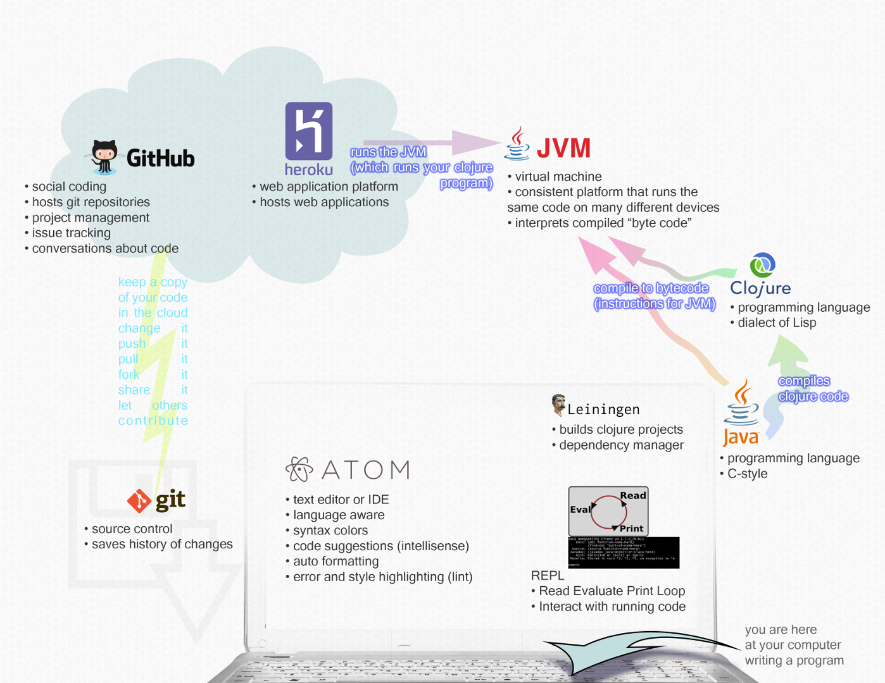

Welcome to ClojureBridge
========================

## Agenda
* [Friday](friday.md)
* [Saturday](saturday.md)

## Introductions

We'll go around the room and ask everyone to introduce themselves and mention
what brings them to ClojureBridge.

## You are here!

This graphic shows you all the tools you will be using today:

## Why Clojure?

* [Why Clojure?](why_clojure.md)

## Using git to save your programs

* [Using git to save your programs](git_intro.md)
